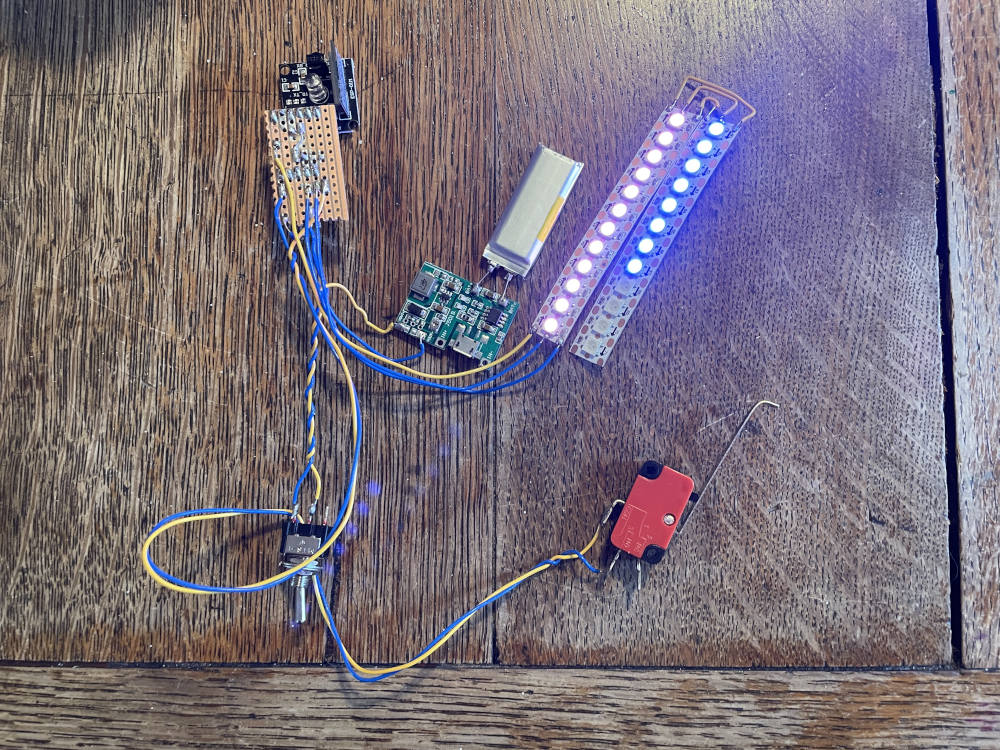
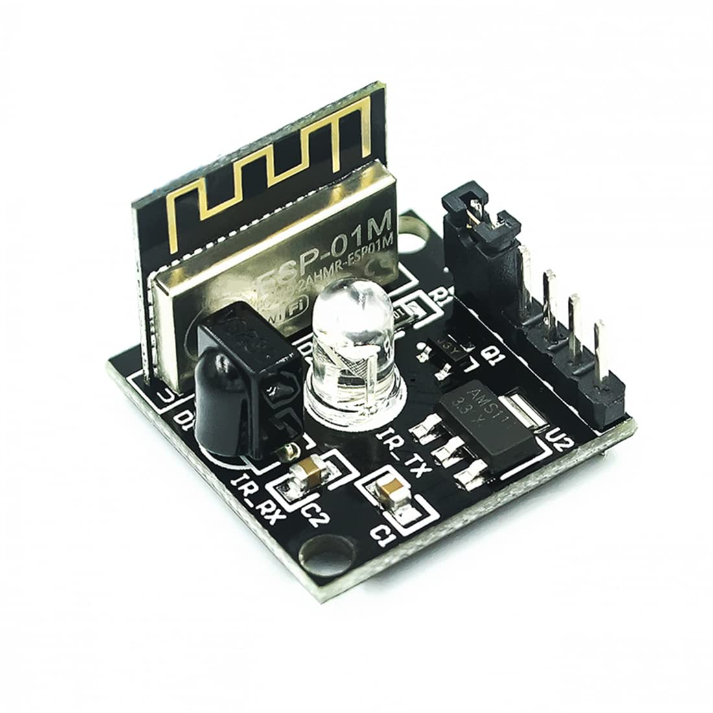

# Bow Quest

A game inspired by minecraft and laser quest. Run around in the woods and ping each other with infra-red arrows. 

Made for a child's birthday party, as quickly as possible!

Uses the infra-red hardware and protocol that's used in remote controls.

### Gameplay:

- Everyone starts with full energy and full health.
- Pull back the string (press button) to charge the string.
- You lose energy as you charge the string.
- Let go to shoot. It will send an infrared message.
- When shot you lose a health point.
- You can't be shot twice quickly, so you have a chance to get away.
- Energy slowly replenishes.
- When you loose all health, you are out of the game.

### Hardware

Hardware is based on ESP8285, infra-red transceiver, and WS2812 addressable LEDs. 

Uses Arduino, with the Adafruit_NeoPixel and IRremote libraries.

I'm using [this "Hailege 2pcs ESP8285 ESP-01M Digital Infrared Transceiver Sensor"](https://www.amazon.co.uk/Hailege-Infrared-Transceiver-Transmitter-Receiver/dp/B0B777ZLLT) for convenience. It's already built, has a voltage regulator, IR circuitry, is small and has enough pins.

### Pinout:

| Board pin | ESP8285 pin | Function             |
| --------- | ----------- | -------------------- |
| 1 GND     | GND         | Trigger 1            |
| 2 IO0     | IO0         | Trigger 2            |
| 3 TX      | 1           | WS2812 LED           |
| 4 RX      | 3           | Spare                |
| 5 5V      | 5V          | Battery +            |
| 6 GND     | GND         | Battery -            |
| IR TX     | 4           | IR TX                |
| IR RX     | 14          | IR RX                |

ESP8285 uses IO0 as the bootloader enable, so it already has a pull-up resistor. This makes it convenient to put trigger switch there. But don't hold down the trigger when you power it on.

### License

MIT <https://opensource.org/license/mit>
